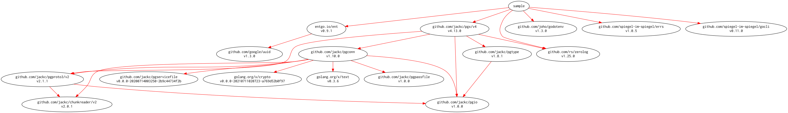

# [ent-sample] -- 「PostgreSQL と ORM と Logging と」サンプルコード（entgo.io/ent 編）

[](https://raw.githubusercontent.com/spiegel-im-spiegel/ent-sample/master/LICENSE)

このリポジトリは拙文「[PostgreSQL と ORM と Logging と](https://zenn.dev/spiegel/books/a-study-in-postgresql)」の説明用サンプルコードとして公開したものです。

以下のようにモジュール名を `sample` としているためそのままインポートして使うことは出来ません。あしからずご了承ください。

```
module sample

go 1.17

require (
    entgo.io/ent v0.9.1
    github.com/jackc/pgx/v4 v4.13.0
    github.com/joho/godotenv v1.3.0
    github.com/rs/zerolog v1.25.0
    github.com/spiegel-im-spiegel/errs v1.0.5
    github.com/spiegel-im-spiegel/gocli v0.11.0
)

require (
    github.com/google/uuid v1.3.0 // indirect
    github.com/jackc/chunkreader/v2 v2.0.1 // indirect
    github.com/jackc/pgconn v1.10.0 // indirect
    github.com/jackc/pgio v1.0.0 // indirect
    github.com/jackc/pgpassfile v1.0.0 // indirect
    github.com/jackc/pgproto3/v2 v2.1.1 // indirect
    github.com/jackc/pgservicefile v0.0.0-20200714003250-2b9c44734f2b // indirect
    github.com/jackc/pgtype v1.8.1 // indirect
    golang.org/x/crypto v0.0.0-20210711020723-a769d52b0f97 // indirect
    golang.org/x/text v0.3.6 // indirect
    gopkg.in/yaml.v3 v3.0.0-20210107192922-496545a6307b // indirect
)
```

[MIT ライセンス](./LICENSE)で公開しているので，ライセンス条件に従ってサンプルコードを複製・配布・改変することは自由です。

## Modules Requirement Graph

[](./dependency.png)

[ent-sample]: https://github.com/spiegel-im-spiegel/ent-sample "spiegel-im-spiegel/ent-sample: 「PostgreSQL と ORM と Logging と」サンプルコード（entgo.io/ent 編）"
